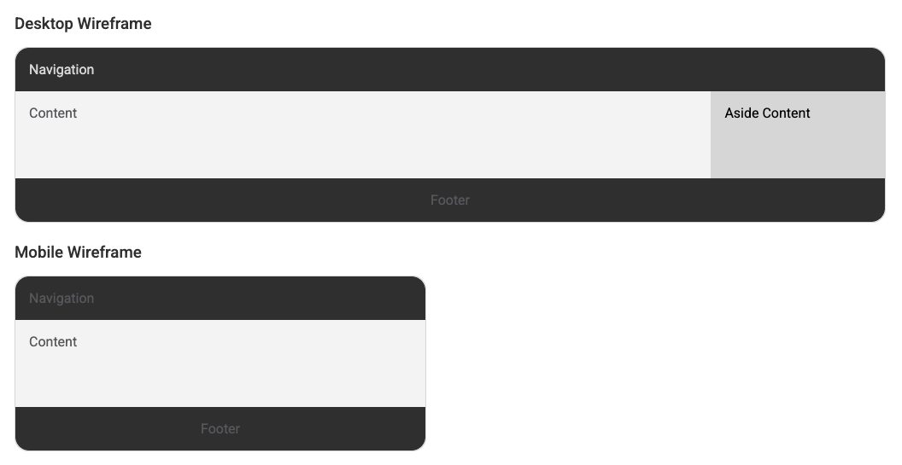

# Final Project Proposal

Project Proposal: Pokemon Cards Listing with Estimated Price

## Overview

The Pokemon Cards Listing with Estimated Price is a web application with the goal of providing users a list of card sets with the expected cards for a given set and listing the cards with detailed information about each card including the estimated price for each card or set. The project is motivated by the curiosity of the Pokemon card and the idea of matching the cards data to stimulate the interest of users in the Pokemon Trading Card Game for collections or for the interest of knowing more about the cards and their details.

## Target Audience

This application is targeted at gamers and collectors of the Pokemon Trading Card Game, as well as for those who are interested in the Pokemon anime and manga series. The application will be useful for:

- Collectors who want to identify the cards or set of cards they have containing the detailed
  information of set and cards with the estimated price when this is available.
- Fans of the Pokemon anime and manga series who want to learn about the cards and specifications of each card and set, with specifications or detailed information that can lead them to be more involved with the Pokemon Trading Card Game.
- Gamers who want to trade cards or search for cards or sets of cards to know the possibilities or group of cards that are available for trading or purchasing.

## Major Functions

1. List of Pokemon Card Sets: the application will provide a list of the card sets available with a
   brief description of each set and the expected cards for each set.

2. List of cards per set: the application will provide a list of cards per set with detailed information
   about each card including the estimated price, when available, and if possible the number of cards that
   should be available on the market.

3. Links to external resources: the application will provide links for external resources, when available,
   to provide alternative sources with specific information that's not provided on the application.

4. Random card picker: the application will provide a list of random cards with the indication of the set
   they belong to with the goal to catch the interest of different card just for the curiosity or fun of knowing
   about something new.

## Wireframes

## External Data

- TCGdex: to fetch a list of pokemon cards and sets, the images will be fetched and cached on the browser
  multiple requests for the same resource.
- PokeAPI: as an alternative source to fetch Pokemon details and information for a given pokemon card.

## Module List

**UI Module**: handles the users interface elements and interactions with the user.
**API Module**: handles the requests to external resources with proper error handling and feedback to the end user.
**Event Handling Module**: handles the interaction with the users and the events triggered by the actions requested by the user.
**Animation Module**: implements the CSS animations and transitions to provide visual experience to the user.

## Graphic Identity

- Color Scheme: a light background with subtle colors and some contrast colors to highlight the information, this will help to make the cards and sets the target of the user interaction.
- Typography: Roboto font family to provide a simple and clean look to the web application.
- Application Icon: a TCG card with a Pokeball in the background to represent the Pokemon Trading Card Game and the Pokemon franchise.

## Timeline

- Week 5: review the project proposal and the API documentations to undersand what the endpoints offer and what are the limitations along with a prototype of the application and functionalities for the main screen and detailed set page and detail card page.
- Week 6: add styling to the application or improve the initial styling with proper CSS and animations to provide a better user experience.
- Week 7: implement the random card picker/display with a proper style and behavior to possibly open on a new page or redirect to the card details page.

## Project Planning

This project proposal describes the plans to create a web application with standard HTML, CSS, and vanilla JavaScript using simple solutions for showcase and research and development of an application with low profile and low complexity. The project will be deployed on GitHub Pages.

## Challenges

- Limitations with the external resources or missing information for given cards or sets.
- The estimated price can lead to misleading information, since the price depends on the market or the availability of the cards.
- Too much information can lead to a poor performance of the application or cause the service to be blocked by the external resources.
